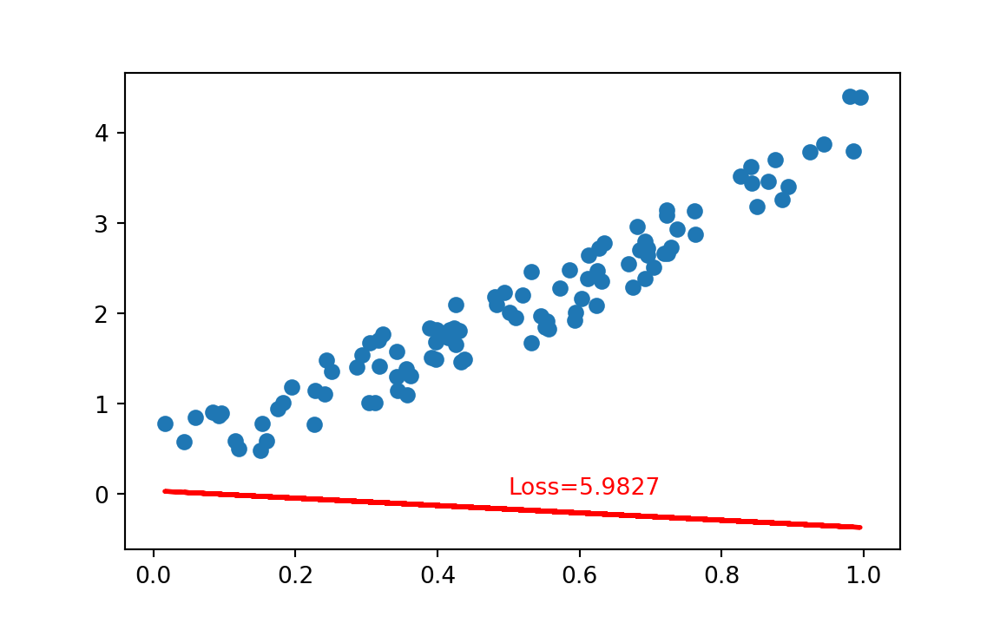
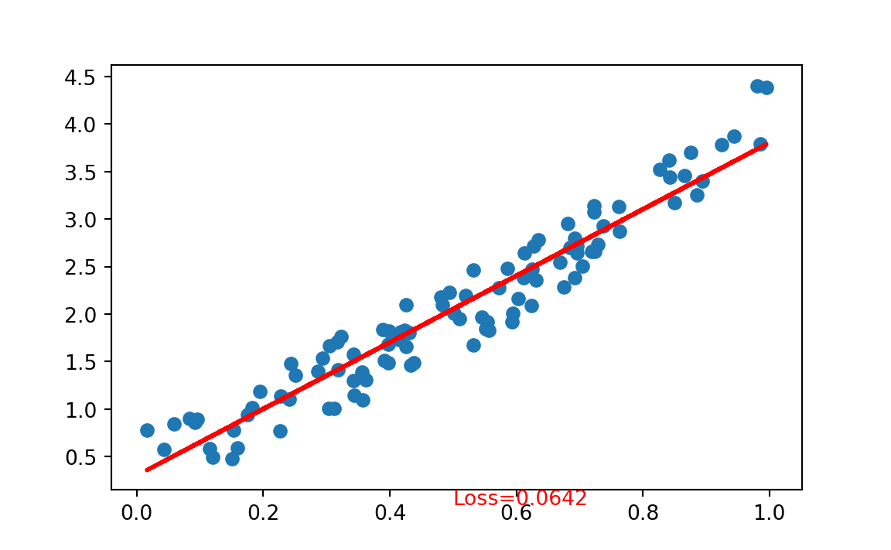

# Simple Regression with PyTorch

Source: https://www.guru99.com/pytorch-tutorial.html

## Creating the network model

Our network model is a simple Linear layer with an input and an output shape of 1.


```r
library(rTorch)
```


```python
from __future__ import print_function

import torch
import torch.nn as nn
import torch.nn.functional as F
from torch.autograd import Variable

torch.manual_seed(123)
#> <torch._C.Generator object at 0x7f3f4528da70>
class Net(nn.Module):
   def __init__(self):
       super(Net, self).__init__()
       self.layer = torch.nn.Linear(1, 1)

   def forward(self, x):
       x = self.layer(x)      
       return x

net = Net()
print(net)
#> Net(
#>   (layer): Linear(in_features=1, out_features=1, bias=True)
#> )
```

And the network output should be like this

```
Net(
  (hidden): Linear(in_features=1, out_features=1, bias=True)
)
```

### Code in R
This would be the equivalent code in R:


```r
library(reticulate)
#> 
#> Attaching package: 'reticulate'
#> The following objects are masked from 'package:rTorch':
#> 
#>     conda_install, conda_python

torch <- import("torch")
nn    <- import("torch.nn")
Variable <- import("torch.autograd")$Variable

torch$manual_seed(123)
#> <torch._C.Generator>

main = py_run_string(
"
import torch.nn as nn

class Net(nn.Module):
   def __init__(self):
       super(Net, self).__init__()
       self.layer = torch.nn.Linear(1, 1)

   def forward(self, x):
       x = self.layer(x)      
       return x
")


# build a Linear Rgression model
net <- main$Net()
print(net)
#> Net(
#>   (layer): Linear(in_features=1, out_features=1, bias=True)
#> )
```


## Datasets

Before you start the training process, you need to know our data. You make a random function to test our model. $Y = x3 sin(x)+ 3x+0.8 rand(100)$


```python
# Visualize our data
import matplotlib.pyplot as plt
import numpy as np

np.random.seed(123)

x = np.random.rand(100)
y = np.sin(x) * np.power(x,3) + 3*x + np.random.rand(100)*0.8

plt.scatter(x, y)
plt.show()
```


This is the code in R:


```r
np    <- import("numpy")

np$random$seed(123L)

x = np$random$rand(100L)
y = np$sin(x) * np$power(x, 3L) + 3*x + np$random$rand(100L)*0.8

plot(x, y)
```


Before you start the training process, you need to convert the numpy array to Variables that supported by Torch and autograd.


```python
# convert numpy array to tensor in shape of input size
x = torch.from_numpy(x.reshape(-1,1)).float()
y = torch.from_numpy(y.reshape(-1,1)).float()
print(x, y)
#> tensor([[0.6965],
#>         [0.2861],
#>         [0.2269],
#>         [0.5513],
#>         [0.7195],
#>         [0.4231],
#>         [0.9808],
#>         [0.6848],
#>         [0.4809],
#>         [0.3921],
#>         [0.3432],
#>         [0.7290],
#>         [0.4386],
#>         [0.0597],
#>         [0.3980],
#>         [0.7380],
#>         [0.1825],
#>         [0.1755],
#>         [0.5316],
#>         [0.5318],
#>         [0.6344],
#>         [0.8494],
#>         [0.7245],
#>         [0.6110],
#>         [0.7224],
#>         [0.3230],
#>         [0.3618],
#>         [0.2283],
#>         [0.2937],
#>         [0.6310],
#>         [0.0921],
#>         [0.4337],
#>         [0.4309],
#>         [0.4937],
#>         [0.4258],
#>         [0.3123],
#>         [0.4264],
#>         [0.8934],
#>         [0.9442],
#>         [0.5018],
#>         [0.6240],
#>         [0.1156],
#>         [0.3173],
#>         [0.4148],
#>         [0.8663],
#>         [0.2505],
#>         [0.4830],
#>         [0.9856],
#>         [0.5195],
#>         [0.6129],
#>         [0.1206],
#>         [0.8263],
#>         [0.6031],
#>         [0.5451],
#>         [0.3428],
#>         [0.3041],
#>         [0.4170],
#>         [0.6813],
#>         [0.8755],
#>         [0.5104],
#>         [0.6693],
#>         [0.5859],
#>         [0.6249],
#>         [0.6747],
#>         [0.8423],
#>         [0.0832],
#>         [0.7637],
#>         [0.2437],
#>         [0.1942],
#>         [0.5725],
#>         [0.0957],
#>         [0.8853],
#>         [0.6272],
#>         [0.7234],
#>         [0.0161],
#>         [0.5944],
#>         [0.5568],
#>         [0.1590],
#>         [0.1531],
#>         [0.6955],
#>         [0.3188],
#>         [0.6920],
#>         [0.5544],
#>         [0.3890],
#>         [0.9251],
#>         [0.8417],
#>         [0.3574],
#>         [0.0436],
#>         [0.3048],
#>         [0.3982],
#>         [0.7050],
#>         [0.9954],
#>         [0.3559],
#>         [0.7625],
#>         [0.5932],
#>         [0.6917],
#>         [0.1511],
#>         [0.3989],
#>         [0.2409],
#>         [0.3435]]) tensor([[2.7166],
#>         [1.3983],
#>         [0.7679],
#>         [1.8464],
#>         [2.6614],
#>         [1.8297],
#>         [4.4034],
#>         [2.7003],
#>         [2.1778],
#>         [1.5073],
#>         [1.2966],
#>         [2.7287],
#>         [1.4884],
#>         [0.8423],
#>         [1.4895],
#>         [2.9263],
#>         [1.0114],
#>         [0.9445],
#>         [1.6729],
#>         [2.4624],
#>         [2.7788],
#>         [3.1746],
#>         [2.6593],
#>         [2.3800],
#>         [3.1382],
#>         [1.7665],
#>         [1.3082],
#>         [1.1390],
#>         [1.5341],
#>         [2.3566],
#>         [0.8612],
#>         [1.4642],
#>         [1.8066],
#>         [2.2308],
#>         [2.0962],
#>         [1.0096],
#>         [1.6538],
#>         [3.3994],
#>         [3.8747],
#>         [2.0045],
#>         [2.0884],
#>         [0.5845],
#>         [1.7039],
#>         [1.7285],
#>         [3.4602],
#>         [1.3581],
#>         [2.0949],
#>         [3.7935],
#>         [2.1950],
#>         [2.6425],
#>         [0.4948],
#>         [3.5188],
#>         [2.1628],
#>         [1.9643],
#>         [1.5740],
#>         [1.0099],
#>         [1.8123],
#>         [2.9534],
#>         [3.6986],
#>         [1.9485],
#>         [2.5445],
#>         [2.4811],
#>         [2.4700],
#>         [2.2838],
#>         [3.4392],
#>         [0.9015],
#>         [2.8687],
#>         [1.4766],
#>         [1.1847],
#>         [2.2782],
#>         [0.8885],
#>         [3.2565],
#>         [2.7141],
#>         [3.0781],
#>         [0.7763],
#>         [2.0038],
#>         [1.8270],
#>         [0.5882],
#>         [0.7793],
#>         [2.6416],
#>         [1.4162],
#>         [2.3851],
#>         [1.9140],
#>         [1.8385],
#>         [3.7822],
#>         [3.6160],
#>         [1.0941],
#>         [0.5721],
#>         [1.6683],
#>         [1.6848],
#>         [2.5068],
#>         [4.3876],
#>         [1.3866],
#>         [3.1286],
#>         [1.9197],
#>         [2.7949],
#>         [0.4797],
#>         [1.8171],
#>         [1.1042],
#>         [1.1414]])
```

### Code in R
Notice that before converting to a Torch tensor, we need first to convert the R numeric vector to a `numpy` array:

```r
# convert numpy array to tensor in shape of input size
x <- r_to_py(x)
y <- r_to_py(y)
x = torch$from_numpy(x$reshape(-1L, 1L)) #$float()
y = torch$from_numpy(y$reshape(-1L, 1L)) #$float()
print(x, y)
#> tensor([[0.6965],
#>         [0.2861],
#>         [0.2269],
#>         [0.5513],
#>         [0.7195],
#>         [0.4231],
#>         [0.9808],
#>         [0.6848],
#>         [0.4809],
#>         [0.3921],
#>         [0.3432],
#>         [0.7290],
#>         [0.4386],
#>         [0.0597],
#>         [0.3980],
#>         [0.7380],
#>         [0.1825],
#>         [0.1755],
#>         [0.5316],
#>         [0.5318],
#>         [0.6344],
#>         [0.8494],
#>         [0.7245],
#>         [0.6110],
#>         [0.7224],
#>         [0.3230],
#>         [0.3618],
#>         [0.2283],
#>         [0.2937],
#>         [0.6310],
#>         [0.0921],
#>         [0.4337],
#>         [0.4309],
#>         [0.4937],
#>         [0.4258],
#>         [0.3123],
#>         [0.4264],
#>         [0.8934],
#>         [0.9442],
#>         [0.5018],
#>         [0.6240],
#>         [0.1156],
#>         [0.3173],
#>         [0.4148],
#>         [0.8663],
#>         [0.2505],
#>         [0.4830],
#>         [0.9856],
#>         [0.5195],
#>         [0.6129],
#>         [0.1206],
#>         [0.8263],
#>         [0.6031],
#>         [0.5451],
#>         [0.3428],
#>         [0.3041],
#>         [0.4170],
#>         [0.6813],
#>         [0.8755],
#>         [0.5104],
#>         [0.6693],
#>         [0.5859],
#>         [0.6249],
#>         [0.6747],
#>         [0.8423],
#>         [0.0832],
#>         [0.7637],
#>         [0.2437],
#>         [0.1942],
#>         [0.5725],
#>         [0.0957],
#>         [0.8853],
#>         [0.6272],
#>         [0.7234],
#>         [0.0161],
#>         [0.5944],
#>         [0.5568],
#>         [0.1590],
#>         [0.1531],
#>         [0.6955],
#>         [0.3188],
#>         [0.6920],
#>         [0.5544],
#>         [0.3890],
#>         [0.9251],
#>         [0.8417],
#>         [0.3574],
#>         [0.0436],
#>         [0.3048],
#>         [0.3982],
#>         [0.7050],
#>         [0.9954],
#>         [0.3559],
#>         [0.7625],
#>         [0.5932],
#>         [0.6917],
#>         [0.1511],
#>         [0.3989],
#>         [0.2409],
#>         [0.3435]], dtype=torch.float64)
```

## Optimizer and Loss
Next, you should define the Optimizer and the Loss Function for our training process.


```python
# Define Optimizer and Loss Function
optimizer = torch.optim.SGD(net.parameters(), lr=0.2)
loss_func = torch.nn.MSELoss()
print(optimizer)
#> SGD (
#> Parameter Group 0
#>     dampening: 0
#>     lr: 0.2
#>     momentum: 0
#>     nesterov: False
#>     weight_decay: 0
#> )
print(loss_func)
#> MSELoss()
```

### Equivalent code in R

```r
# Define Optimizer and Loss Function
optimizer <- torch$optim$SGD(net$parameters(), lr=0.2)
loss_func <- torch$nn$MSELoss()
print(optimizer)
#> SGD (
#> Parameter Group 0
#>     dampening: 0
#>     lr: 0.2
#>     momentum: 0
#>     nesterov: False
#>     weight_decay: 0
#> )
print(loss_func)
#> MSELoss()
```

## Training
### Code in Python
Now let's start our training process. With an epoch of 250, you will iterate our data to find the best value for our hyperparameters.


```python
inputs = Variable(x)
outputs = Variable(y)
for i in range(250):
   prediction = net(inputs)
   loss = loss_func(prediction, outputs) 
   optimizer.zero_grad()
   loss.backward()        
   optimizer.step()       

   if i % 10 == 0:
       # plot and show learning process
       plt.cla()
       plt.scatter(x.data.numpy(), y.data.numpy())
       plt.plot(x.data.numpy(), prediction.data.numpy(), 'r-', lw=2)
       plt.text(0.5, 0, 'Loss=%.4f' % loss.data.numpy(), fontdict={'size': 10, 'color':  'red'})
       plt.pause(0.1)
```



```python
plt.show()
```


### Code in R


```r
x = x$type(torch$FloatTensor)   # make it a a FloatTensor
y = y$type(torch$FloatTensor)

inputs = Variable(x)
outputs = Variable(y)
plot(x$data$numpy(), y$data$numpy(), col = "blue")
for (i in 1:250) {
   prediction = net(inputs)
   loss = loss_func(prediction, outputs)
   optimizer$zero_grad()
   loss$backward()
   optimizer$step()

   if (i %% 10 == 0) {
       # plot and show learning process
      # points(x$data$numpy(), y$data$numpy())
      points(x$data$numpy(), prediction$data$numpy(), col="red")
       # cat(i, loss$data$numpy(), "\n")
   }
}
```


## Result

As you can see below, you successfully performed regression with a neural network. Actually, on every iteration, the red line in the plot will update and change its position to fit the data. But in this picture, you only show you the final result


