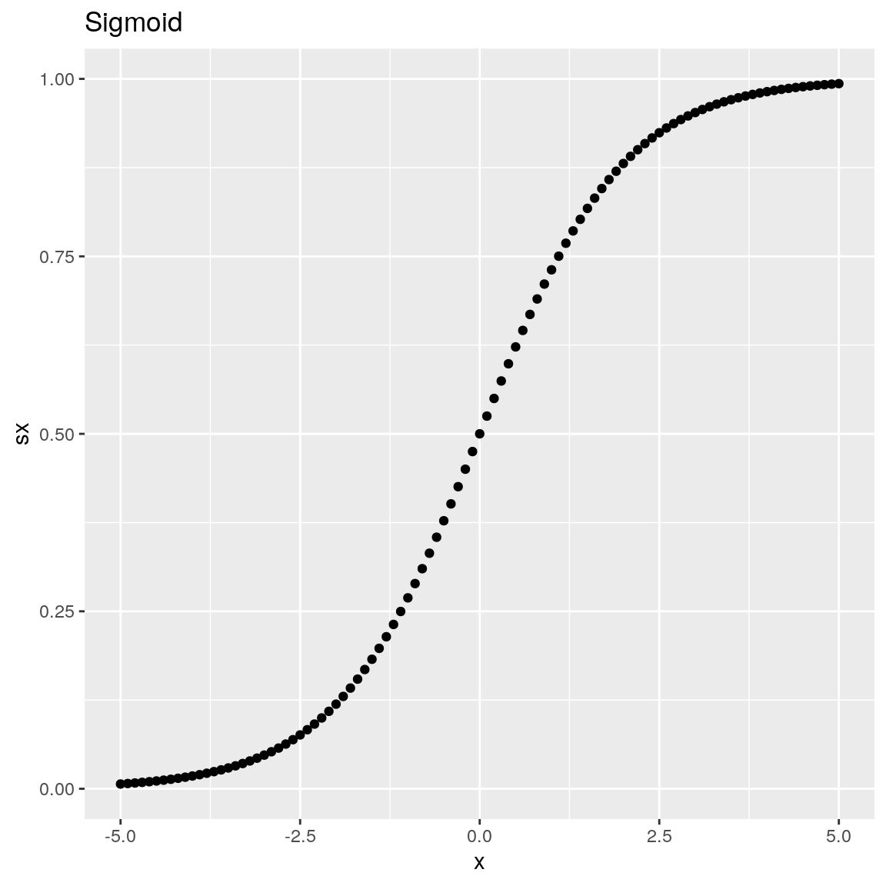
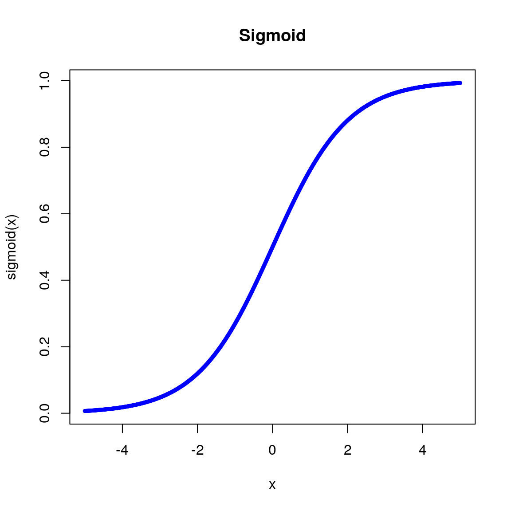
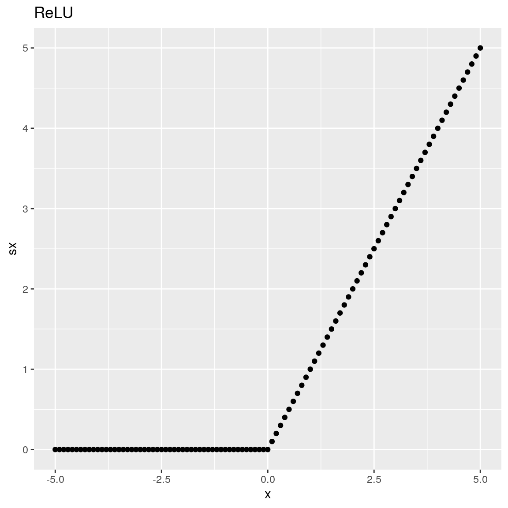
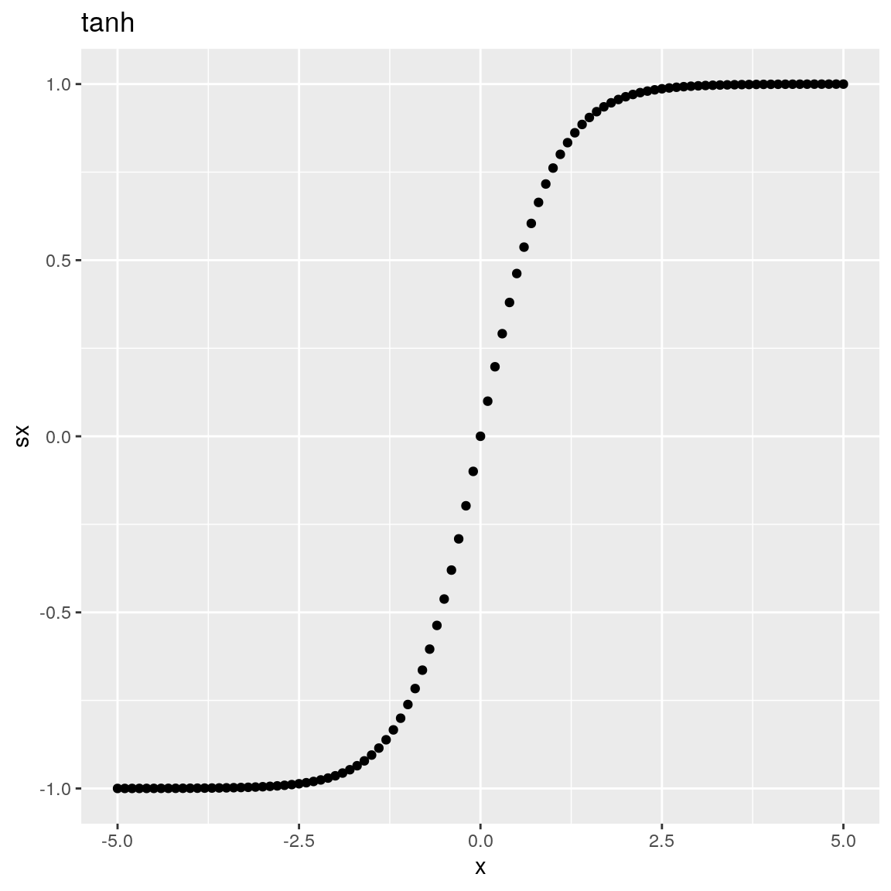
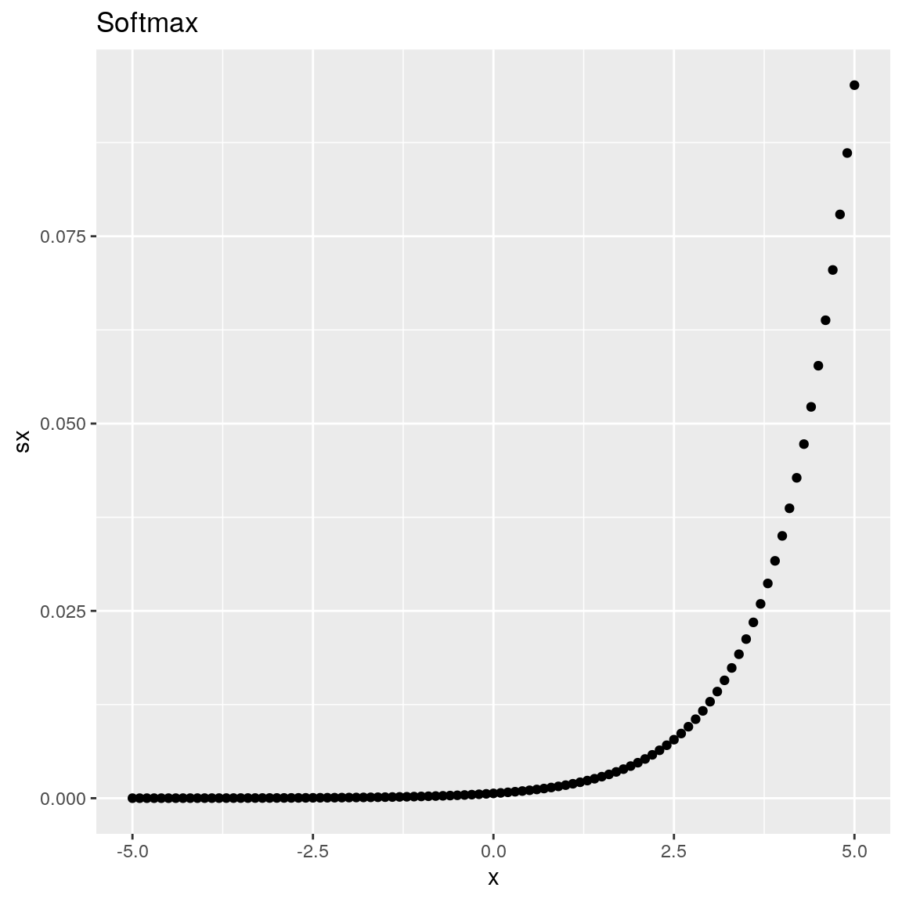
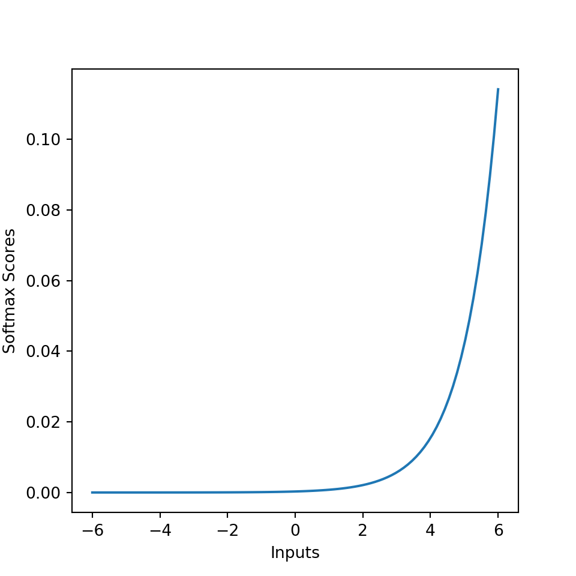

\cleardoublepage


# Activation Functions {#appendixB}


```r
library(rTorch)
library(ggplot2)
```

## The Sigmoid function

Using the PyTorch `sigmoid()` function:


```r
x <- torch$range(-5., 5., 0.1)
y <- torch$sigmoid(x)

df <- data.frame(x = x$numpy(), sx = y$numpy())
df
#>        x      sx
#> 1   -5.0 0.00669
#> 2   -4.9 0.00739
#> 3   -4.8 0.00816
#> 4   -4.7 0.00901
#> 5   -4.6 0.00995
#> 6   -4.5 0.01099
#> 7   -4.4 0.01213
#> 8   -4.3 0.01339
#> 9   -4.2 0.01477
#> 10  -4.1 0.01630
#> 11  -4.0 0.01799
#> 12  -3.9 0.01984
#> 13  -3.8 0.02188
#> 14  -3.7 0.02413
#> 15  -3.6 0.02660
#> 16  -3.5 0.02931
#> 17  -3.4 0.03230
#> 18  -3.3 0.03557
#> 19  -3.2 0.03917
#> 20  -3.1 0.04311
#> 21  -3.0 0.04743
#> 22  -2.9 0.05215
#> 23  -2.8 0.05732
#> 24  -2.7 0.06297
#> 25  -2.6 0.06914
#> 26  -2.5 0.07586
#> 27  -2.4 0.08317
#> 28  -2.3 0.09112
#> 29  -2.2 0.09975
#> 30  -2.1 0.10910
#> 31  -2.0 0.11920
#> 32  -1.9 0.13011
#> 33  -1.8 0.14185
#> 34  -1.7 0.15447
#> 35  -1.6 0.16798
#> 36  -1.5 0.18243
#> 37  -1.4 0.19782
#> 38  -1.3 0.21417
#> 39  -1.2 0.23148
#> 40  -1.1 0.24974
#> 41  -1.0 0.26894
#> 42  -0.9 0.28905
#> 43  -0.8 0.31003
#> 44  -0.7 0.33181
#> 45  -0.6 0.35434
#> 46  -0.5 0.37754
#> 47  -0.4 0.40131
#> 48  -0.3 0.42556
#> 49  -0.2 0.45017
#> 50  -0.1 0.47502
#> 51   0.0 0.50000
#> 52   0.1 0.52498
#> 53   0.2 0.54983
#> 54   0.3 0.57444
#> 55   0.4 0.59869
#> 56   0.5 0.62246
#> 57   0.6 0.64566
#> 58   0.7 0.66819
#> 59   0.8 0.68997
#> 60   0.9 0.71095
#> 61   1.0 0.73106
#> 62   1.1 0.75026
#> 63   1.2 0.76852
#> 64   1.3 0.78584
#> 65   1.4 0.80218
#> 66   1.5 0.81757
#> 67   1.6 0.83202
#> 68   1.7 0.84553
#> 69   1.8 0.85815
#> 70   1.9 0.86989
#> 71   2.0 0.88080
#> 72   2.1 0.89090
#> 73   2.2 0.90025
#> 74   2.3 0.90888
#> 75   2.4 0.91683
#> 76   2.5 0.92414
#> 77   2.6 0.93086
#> 78   2.7 0.93703
#> 79   2.8 0.94268
#> 80   2.9 0.94785
#> 81   3.0 0.95257
#> 82   3.1 0.95689
#> 83   3.2 0.96083
#> 84   3.3 0.96443
#> 85   3.4 0.96770
#> 86   3.5 0.97069
#> 87   3.6 0.97340
#> 88   3.7 0.97587
#> 89   3.8 0.97812
#> 90   3.9 0.98016
#> 91   4.0 0.98201
#> 92   4.1 0.98370
#> 93   4.2 0.98523
#> 94   4.3 0.98661
#> 95   4.4 0.98787
#> 96   4.5 0.98901
#> 97   4.6 0.99005
#> 98   4.7 0.99099
#> 99   4.8 0.99184
#> 100  4.9 0.99261
#> 101  5.0 0.99331

ggplot(df, aes(x = x, y = sx)) + 
    geom_point() +
    ggtitle("Sigmoid")
```




Plot the sigmoid function using an R custom-made function:


```r
sigmoid = function(x) {
   1 / (1 + exp(-x))
}

x <- seq(-5, 5, 0.01)
plot(x, sigmoid(x), col = 'blue', cex = 0.5, main = "Sigmoid")
```



## The ReLU function

Using the PyTorch `relu()` function:


```r
x <- torch$range(-5., 5., 0.1)
y <- torch$relu(x)

df <- data.frame(x = x$numpy(), sx = y$numpy())
df

ggplot(df, aes(x = x, y = sx)) + 
    geom_point() +
    ggtitle("ReLU")
```




## The tanh function

Using the PyTorch `tanh()` function:


```r
x <- torch$range(-5., 5., 0.1)
y <- torch$tanh(x)

df <- data.frame(x = x$numpy(), sx = y$numpy())
df

ggplot(df, aes(x = x, y = sx)) + 
    geom_point() +
    ggtitle("tanh")
```




## The Softmax Activation function

Using the PyTorch `softmax()` function:


```r
x <- torch$range(-5.0, 5.0, 0.1)
y <- torch$softmax(x, dim=0L)

df <- data.frame(x = x$numpy(), sx = y$numpy())

ggplot(df, aes(x = x, y = sx)) + 
    geom_point() +
    ggtitle("Softmax")
```




## Coding your own activation functions in Python


```r
library(rTorch)
```


```python
import numpy as np
import matplotlib.pyplot as plt
np.random.seed(42)
```

### Linear activation {-}


```python
def Linear(x, derivative=False):
    """
    Computes the Linear activation function for array x
    inputs:
    x: array
    derivative: if True, return the derivative else the forward pass
    """
    
    if derivative:              # Return derivative of the function at x
        return np.ones_like(x)
    else:                       # Return forward pass of the function at x
        return x
```

### Sigmoid activation {-}


```python
def Sigmoid(x, derivative=False):
    """
    Computes the Sigmoid activation function for array x
    inputs:
    x: array 
    derivative: if True, return the derivative else the forward pass
    """
    f = 1/(1+np.exp(-x))
    
    if derivative:              # Return derivative of the function at x
        return f*(1-f)
    else:                       # Return forward pass of the function at x
        return f
```


### Hyperbolic Tangent activation {-}


```python
def Tanh(x, derivative=False):
    """
    Computes the Hyperbolic Tangent activation function for array x
    inputs:
    x: array 
    derivative: if True, return the derivative else the forward pass
    """
    f = (np.exp(x)-np.exp(-x))/(np.exp(x)+np.exp(-x))
    
    if derivative:              # Return  derivative of the function at x
        return 1-f**2
    else:                       # Return the forward pass of the function at x
        return f
```


### Rectifier linear unit (ReLU) {-}


```python
def ReLU(x, derivative=False):
    """
    Computes the Rectifier Linear Unit activation function for array x
    inputs:
    x: array
    derivative: if True, return the derivative else the forward pass
    """
    
    if derivative:              # Return derivative of the function at x
        return (x>0).astype(int)
    else:                       # Return forward pass of the function at x
        return np.maximum(x, 0)
```


### Visualization with `matplotlib` {-}
Plotting using `matplotlib`:


```python
x = np.linspace(-6, 6, 100)
units = {
    "Linear": lambda x: Linear(x),
    "Sigmoid": lambda x: Sigmoid(x),
    "ReLU": lambda x: ReLU(x),
    "tanh": lambda x: Tanh(x)
}

plt.figure(figsize=(5, 5))
[plt.plot(x, unit(x), label=unit_name, lw=2) 
    for unit_name, unit in units.items()]
plt.legend(loc=2, fontsize=16)
plt.title('Activation functions', fontsize=20)
plt.ylim([-2, 5])
plt.xlim([-6, 6])
plt.show()
```


## Softmax in Python


```python
# Source: https://dataaspirant.com/2017/03/07/difference-between-softmax-function-and-sigmoid-function/
import numpy as np
import matplotlib.pyplot as plt
 
 
def softmax(inputs):
    """
    Calculate the softmax for the give inputs (array)
    :param inputs:
    :return:
    """
    return np.exp(inputs) / float(sum(np.exp(inputs)))
 
 
def line_graph(x, y, x_title, y_title):
    """
    Draw line graph with x and y values
    :param x:
    :param y:
    :param x_title:
    :param y_title:
    :return:
    """
    plt.plot(x, y)
    plt.xlabel(x_title)
    plt.ylabel(y_title)
    plt.show()
 
 
graph_x = np.linspace(-6, 6, 100)
graph_y = softmax(graph_x)
 
print("Graph X readings: {}".format(graph_x))
print("Graph Y readings: {}".format(graph_y))
 
line_graph(graph_x, graph_y, "Inputs", "Softmax Scores")
```



